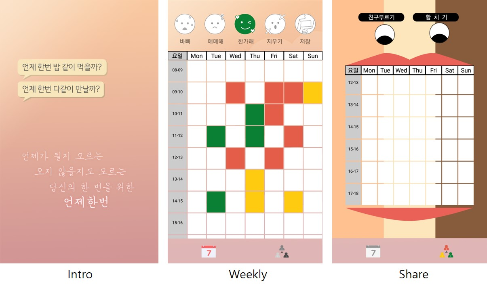
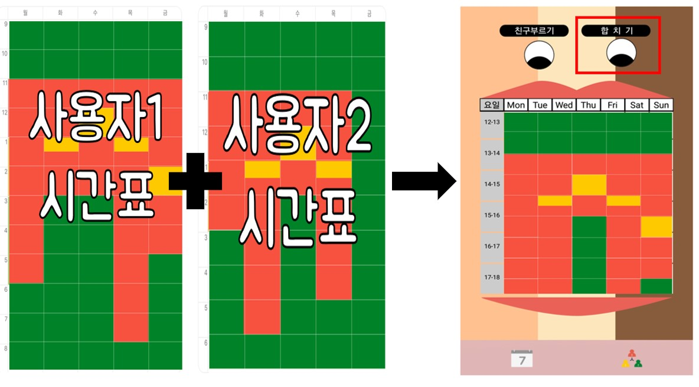

# 앱 개발: 언제 한 번

- 1학년 1학기: `창의코딩 스마트앱` 수업에서 `MIT App Inventor`를 사용하여 애플리케이션의 prototype 완성
- 1학년 2학기: `Android Studio`, `Firebase` 사용하여 최종적인 애플리케이션 구현

## 애플리케이션 목적
'언제 한 번' 말뿐인 바쁜 삶에서 약속 한 번 잡기 힘든 요즈음. 서로의 스케줄을 파악하여 만날 수 있는 시간대를 대신 정해주어 약속시간 선정에 대한 불편함이 해소시킬 수 있는 애플리케이션이다.

일정이 있어 약속을 잡을 수 없다면 `빨강`, 약속잡기 애매한 시간이라면 `주황`, 일정이 없어 약속을 잡을 수 있다면 `초록`을 사용해서 시간표를 만든다. 그 후 앱 사용자들의 시간표를 중첩하여 서로 만날 수 있는 시간대를 확인할 수 있다.

## 애플리케이션 기능

#### weekly page

- 위 사진에서 소개된 각 버튼을 선택하여 사용자 개개인의 시간표 작성

#### share page

- 친구부르기 버튼: 시간표를 중학하고 싶은 친구 선택
- 합치기 버튼: 시간표 중첩하기
- 중첩 원리
	- 빨간색 + (3가지 색) --> 빨간색
	- 주황색 + (주황, 초록) -> 주황색
	- 초록색 + 초록색 --> 초록색

## 애플리케이션 구현
- AndroidStudio 3.2 버전
- Firebase
